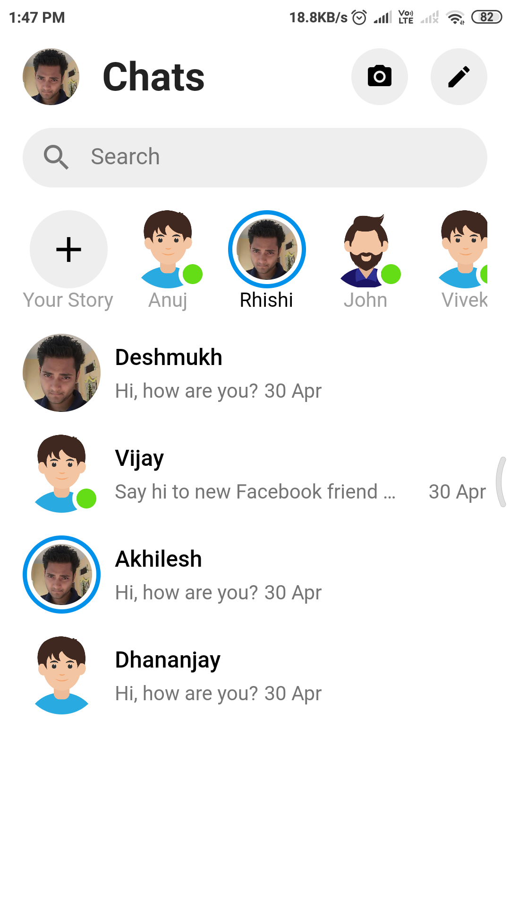
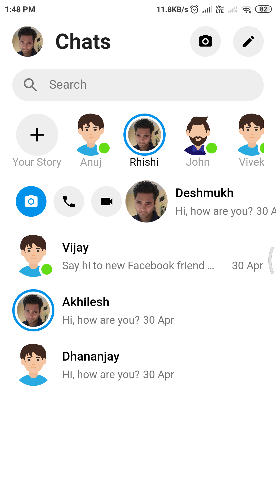
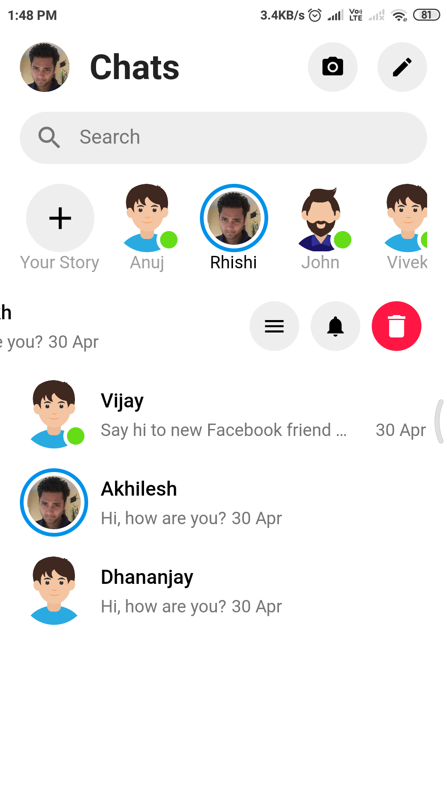

# Facebook Messenger Ui in Flutter

## Getting Started

For help getting started with Flutter, view our online
[documentation](https://flutter.io/).

## Library used

[flutter_slidable](https://pub.dartlang.org/packages/flutter_slidable)  

## Screenshots
&nbsp;&nbsp;&nbsp;&nbsp;&nbsp;&nbsp;&nbsp;&nbsp;&nbsp;&nbsp;&nbsp;&nbsp;&nbsp;&nbsp;&nbsp;&nbsp;&nbsp;&nbsp;&nbsp;&nbsp;&nbsp;&nbsp;&nbsp;&nbsp;

&nbsp;&nbsp;&nbsp;&nbsp;&nbsp;&nbsp;&nbsp;&nbsp;&nbsp;&nbsp;&nbsp;&nbsp;

## Created & Maintained By

[Vivek Sharma](https://github.com/follow2vivek)
